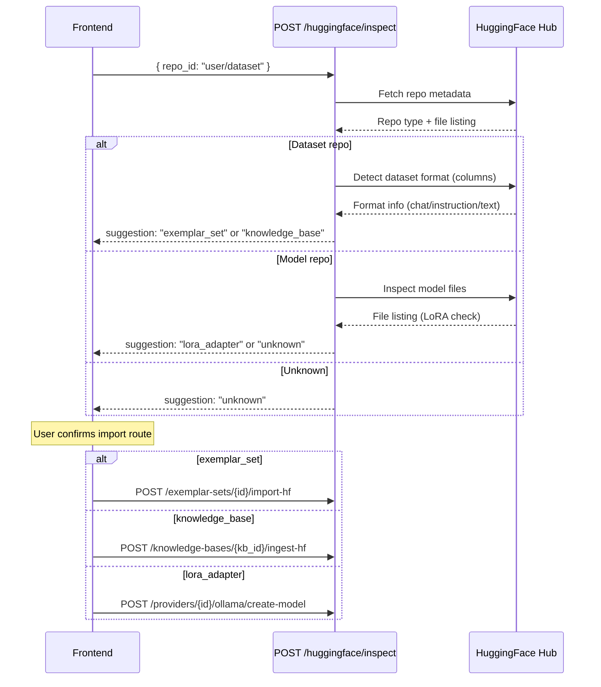

# API Reference

Base URL: `/api/v1`

All endpoints except register and login require a Bearer token in the `Authorization` header.

Admin endpoints require a user with `role: "admin"`.

---

## Authentication

### POST /auth/register

Create a new user account.

**Auth required:** No

**Request:**
```json
{
  "username": "jdoe",
  "email": "jdoe@example.com",
  "password": "securepassword",
  "display_name": "Jane Doe"
}
```

| Field          | Type   | Required | Notes                    |
|----------------|--------|----------|--------------------------|
| `username`     | string | yes      | Must be unique           |
| `email`        | string | yes      | Must be valid email      |
| `password`     | string | yes      |                          |
| `display_name` | string | no       | Defaults to username     |

**Response (201):**
```json
{
  "id": "507f1f77bcf86cd799439011",
  "message": "User registered successfully"
}
```

**Errors:** 409 if username or email already exists.

---

### POST /auth/login

Authenticate and receive JWT tokens.

**Auth required:** No

**Request:**
```json
{
  "username": "jdoe",
  "password": "securepassword"
}
```

**Response (200):**
```json
{
  "access_token": "eyJhbG...",
  "refresh_token": "eyJhbG...",
  "token_type": "bearer"
}
```

**Errors:** 401 if credentials are invalid.

**Notes:**
- Access token expires after `JWT_EXPIRATION_MINUTES` (default: 60)
- Refresh token expires after `JWT_REFRESH_EXPIRATION_DAYS` (default: 7)

---

### POST /auth/refresh

Exchange a refresh token for new access + refresh tokens.

**Auth required:** No (uses refresh token in body)

**Request:**
```json
{
  "refresh_token": "eyJhbG..."
}
```

**Response (200):**
```json
{
  "access_token": "eyJhbG...",
  "refresh_token": "eyJhbG...",
  "token_type": "bearer"
}
```

**Notes:** The old refresh token is revoked in Redis after use.

---

### GET /auth/me

Get the current authenticated user's profile.

**Auth required:** Yes

**Response (200):**
```json
{
  "id": "507f1f77bcf86cd799439011",
  "username": "jdoe",
  "email": "jdoe@example.com",
  "display_name": "Jane Doe",
  "role": "user",
  "auth_provider": "local"
}
```

---

## Agents

### GET /agents

List active agents with pagination, tag filtering, search, and sorting.

**Auth required:** Yes

**Query parameters:**

| Param    | Type   | Default  | Notes                                    |
|----------|--------|----------|------------------------------------------|
| `tag`    | string | none     | Filter by tag (e.g., `default-dashboard`) |
| `search` | string | none    | Search name, description, specializations |
| `sort`   | string | newest   | `newest`, `oldest`, `name`               |
| `limit`  | int    | 50       | Max results                              |
| `offset` | int    | 0        | Pagination skip                          |

**Response (200):**
```json
{
  "agents": [
[
  {
    "id": "507f1f77bcf86cd799439011",
    "name": "Code Architect",
    "slug": "code-architect",
    "description": "Expert in software design patterns...",
    "tags": ["default-agent", "default-dashboard"],
    "avatar_url": null,
    "specializations": ["architecture", "code-review"],
    "preferred_model": "openai/gpt-4o",
    "knowledge_base_ids": [],
    "exemplar_set_ids": [],
    "search_provider_ids": [],
    "collaboration_capable": true,
    "collaboration_role": "specialist",
    "is_active": true
  }
  ],
  "total": 21,
  "all_tags": ["default-agent", "default-dashboard"]
}
```

---

### GET /agents/{slug}

Get a single agent by slug.

**Auth required:** Yes

**Response (200):** Same shape as list item above.

**Errors:** 404 if slug not found.

---

### POST /agents

Create a new agent.

**Auth required:** Admin

**Request:**
```json
{
  "name": "DevOps Engineer",
  "slug": "devops-engineer",
  "description": "Expert in CI/CD and infrastructure.",
  "system_prompt": "You are a senior DevOps engineer...",
  "specializations": ["devops", "ci-cd", "kubernetes"],
  "preferred_model": "openai/gpt-4o",
  "fallback_models": ["anthropic/claude-sonnet-4-20250514"],
  "temperature": 0.5,
  "max_tokens": 4096,
  "collaboration_capable": true,
  "collaboration_role": "specialist"
}
```

| Field                   | Type     | Required | Default | Notes                              |
|-------------------------|----------|----------|---------|------------------------------------|
| `name`                  | string   | yes      |         | Display name                       |
| `slug`                  | string   | yes      |         | URL-safe, unique                   |
| `description`           | string   | yes      |         |                                    |
| `system_prompt`         | string   | yes      |         | Sent as system message to LLM      |
| `avatar_url`            | string   | no       | null    |                                    |
| `specializations`       | string[] | no       | []      | Tags for categorization            |
| `preferred_model`       | string   | yes      |         | Format: `provider/model_name`      |
| `fallback_models`       | string[] | no       | []      | Tried in order if preferred fails  |
| `temperature`           | float    | no       | 0.7     | 0.0 to 1.0                        |
| `max_tokens`            | int      | no       | 4096    |                                    |
| `tags`                  | string[] | no       | []      | Agent tags for filtering           |
| `knowledge_base_ids`    | string[] | no       | []      | IDs of linked knowledge bases      |
| `exemplar_set_ids`      | string[] | no       | []      | IDs of linked exemplar sets        |
| `search_provider_ids`   | string[] | no       | []      | IDs of assigned search providers   |
| `collaboration_capable` | bool     | no       | false   |                                    |
| `collaboration_role`    | string   | no       | null    | One of: `orchestrator`, `specialist`, `critic`, `synthesizer`, `researcher`, `devil_advocate` |

**Response (201):**
```json
{ "id": "507f1f77bcf86cd799439011" }
```

**Errors:** 409 if slug already exists.

---

### PUT /agents/{slug}

Update an agent. Only include fields you want to change.

**Auth required:** Admin

**Request:**
```json
{
  "temperature": 0.3,
  "max_tokens": 8192
}
```

All fields from AgentCreate are accepted (except `slug`), all optional.

**Response (200):**
```json
{ "message": "Agent updated" }
```

---

### DELETE /agents/{slug}

Soft-delete (deactivate) an agent. Sets `is_active: false`.

**Auth required:** Admin

**Response (200):**
```json
{ "message": "Agent deactivated" }
```

---

### PUT /agents/bulk-model

Bulk-update the preferred model for multiple agents.

**Auth required:** Admin

**Request:**
```json
{
  "agent_slugs": ["security-analyst", "devops-engineer", "frontend-lead"],
  "preferred_model": "ollama/llama3"
}
```

Set `preferred_model` to `null` to clear (agents will use system default).

**Response (200):**
```json
{ "message": "Updated 3 agents" }
```

---

### POST /agents/export

Export selected agents as a JSON archive.

**Auth required:** Admin

**Request:**
```json
{ "slugs": ["security-analyst", "devops-engineer"] }
```

**Response (200):**
```json
{
  "version": 1,
  "agents": [
    {
      "name": "Security Analyst",
      "slug": "security-analyst",
      "description": "...",
      "system_prompt": "...",
      "specializations": ["appsec", "threat-modeling"],
      "preferred_model": null,
      "fallback_models": [],
      "temperature": 0.4,
      "max_tokens": 4096,
      "collaboration_capable": true,
      "collaboration_role": "critic"
    }
  ]
}
```

---

### POST /agents/import

Import agents from a JSON archive. Skips agents whose slug already exists.

**Auth required:** Admin

**Request:** Same format as export response (the archive JSON).

**Response (200):**
```json
{
  "created": 3,
  "skipped": 1,
  "skipped_slugs": ["security-analyst"]
}
```

---

### POST /agents/build

Use AI to generate an agent profile from a natural-language description.

**Auth required:** Admin

**Request:**
```json
{
  "description": "A Kubernetes expert who is sarcastic"
}
```

| Field         | Type   | Required | Notes                            |
|---------------|--------|----------|----------------------------------|
| `description` | string | yes      | What kind of agent the user wants |

**Response (200):**
```json
{
  "profile": {
    "name": "K8s Overlord",
    "slug": "k8s-overlord",
    "description": "Sarcastic Kubernetes guru who judges your YAML.",
    "system_prompt": "You are a senior Kubernetes engineer with a dry, sarcastic wit...",
    "specializations": ["kubernetes", "containers", "devops"],
    "temperature": 0.7,
    "max_tokens": 4096,
    "collaboration_role": "specialist"
  }
}
```

**Notes:**
- Uses the system default model to generate the profile
- The returned profile is not saved automatically — pass it to `POST /agents` to create the agent
- If the AI output cannot be parsed as JSON, returns `{"error": "Failed to parse AI response", "raw": "..."}`

---

## Providers

### GET /providers

List all LLM providers.

**Auth required:** Yes

**Response (200):**
```json
[
  {
    "id": "507f1f77bcf86cd799439011",
    "name": "openai",
    "display_name": "OpenAI",
    "provider_type": "openai",
    "api_base": null,
    "has_api_key": true,
    "is_enabled": true
  }
]
```

**Notes:** `has_api_key` indicates whether a key is stored (never exposes the actual key).

---

### POST /providers

Add a new LLM provider.

**Auth required:** Admin

**Request:**
```json
{
  "name": "ollama",
  "display_name": "Ollama (Local)",
  "provider_type": "ollama",
  "api_base": "http://host.docker.internal:11434",
  "api_key": null,
  "is_enabled": true
}
```

| Field           | Type   | Required | Default | Notes                                      |
|-----------------|--------|----------|---------|--------------------------------------------|
| `name`          | string | yes      |         | Unique identifier                          |
| `display_name`  | string | yes      |         | Shown in UI                                |
| `provider_type` | string | yes      |         | `openai`, `anthropic`, `ollama`, `google`  |
| `api_base`      | string | no       | null    | Custom API URL (required for Ollama)       |
| `api_key`       | string | no       | null    | Encrypted at rest with Fernet              |
| `is_enabled`    | bool   | no       | true    |                                            |

**Response (201):**
```json
{ "id": "507f1f77bcf86cd799439011" }
```

**Errors:** 409 if name already exists.

---

### PUT /providers/{provider_id}

Update a provider. Only include fields you want to change.

**Auth required:** Admin

**Request:**
```json
{
  "api_key": "sk-new-key-...",
  "is_enabled": true
}
```

**Response (200):**
```json
{ "message": "Provider updated" }
```

---

### DELETE /providers/{provider_id}

Delete a provider.

**Auth required:** Admin

**Response (200):**
```json
{ "message": "Provider deleted" }
```

---

### GET /providers/{provider_id}/models

List models available from a specific provider.

**Auth required:** Yes

**Response (200):**
```json
[
  {
    "id": "openai/gpt-4o",
    "name": "gpt-4o",
    "provider": "openai",
    "provider_display_name": "OpenAI"
  }
]
```

**Notes:**
- Results are cached in Redis for 5 minutes
- For Ollama, queries the `/api/tags` endpoint
- For OpenAI, queries `/v1/models`
- For Anthropic and Google, returns a hardcoded list of known models

---

### GET /providers/models/all

List models from all enabled providers.

**Auth required:** Yes

**Response (200):** Same shape as above, aggregated across providers. Providers that fail to respond are silently skipped.

---

### POST /providers/{provider_id}/test

Test connectivity to a provider.

**Auth required:** Admin

**Response (200):**
```json
{ "status": "ok", "model_count": 12 }
```

Or on failure:
```json
{ "status": "error", "detail": "Connection refused" }
```

---

### POST /providers/{provider_id}/ollama/create-model

Create a custom Ollama model from a base model and a LoRA adapter.

**Auth required:** Admin

**Request:**
```json
{
  "model_name": "my-custom-llama",
  "base_model": "llama3",
  "adapter_path": "/path/to/adapter",
  "system_prompt": "You are a helpful assistant."
}
```

| Field           | Type   | Required | Default | Notes                                      |
|-----------------|--------|----------|---------|--------------------------------------------|
| `model_name`    | string | yes      |         | Name for the new Ollama model              |
| `base_model`    | string | yes      |         | Base model to build on (e.g., `llama3`)    |
| `adapter_path`  | string | yes      |         | Filesystem path to the LoRA adapter files  |
| `system_prompt` | string | no       | null    | Default system prompt baked into the model |

**Response (200):**
```json
{ "status": "ok", "model_name": "my-custom-llama" }
```

**Errors:** 404 if provider not found or is not an Ollama provider.

---

### POST /providers/{provider_id}/ollama/delete-model

Delete a model from an Ollama provider.

**Auth required:** Admin

**Request:**
```json
{
  "model_name": "my-custom-llama"
}
```

| Field        | Type   | Required | Notes                        |
|--------------|--------|----------|------------------------------|
| `model_name` | string | yes      | Name of the Ollama model to delete |

**Response (200):**
```json
{ "status": "ok", "model_name": "my-custom-llama" }
```

**Errors:** 404 if provider not found or is not an Ollama provider.

---

## Conversations

### GET /conversations

List the current user's conversations.

**Auth required:** Yes

**Query parameters:**

| Param    | Type | Default | Notes           |
|----------|------|---------|-----------------|
| `limit`  | int  | 50      | Max results     |
| `offset` | int  | 0       | Pagination skip |

**Response (200):**
```json
[
  {
    "id": "507f1f77bcf86cd799439011",
    "title": "Help with Docker setup",
    "agent_id": "507f1f77bcf86cd799439012",
    "model": "openai/gpt-4o",
    "message_count": 5,
    "created_at": "2026-04-04T10:00:00Z",
    "updated_at": "2026-04-04T10:05:00Z"
  }
]
```

---

### POST /conversations

Create a new conversation. Three modes are supported: single-agent chat, direct model chat, or kabAInet collaboration.

**Auth required:** Yes

**Request (single agent):**
```json
{
  "agent_id": "507f1f77bcf86cd799439012",
  "title": "Architecture review"
}
```

**Request (direct model):**
```json
{
  "model": "openai/gpt-4o",
  "title": "Quick question"
}
```

**Request (kabAInet collaboration):**
```json
{
  "agent_ids": ["507f1f77bcf86cd799439012", "507f1f77bcf86cd799439013", "507f1f77bcf86cd799439014"],
  "collaboration_mode": "kabainet",
  "title": "Security architecture review"
}
```

| Field                | Type     | Required | Notes                                        |
|----------------------|----------|----------|----------------------------------------------|
| `agent_id`           | string   | no       | Use agent's model and system prompt          |
| `agent_ids`          | string[] | no       | List of agent IDs for kabAInet mode        |
| `collaboration_mode` | string   | no       | Set to `"kabainet"` for multi-agent chat   |
| `model`              | string   | no       | Required if `agent_id` is null and not kabAInet |
| `title`              | string   | no       | Auto-generated if omitted                    |

**Response (201):**
```json
{ "id": "507f1f77bcf86cd799439011" }
```

---

### GET /conversations/{conversation_id}

Get a conversation with full message history.

**Auth required:** Yes (must be conversation owner)

**Response (200):**
```json
{
  "id": "507f1f77bcf86cd799439011",
  "title": "Architecture review",
  "agent_id": "507f1f77bcf86cd799439012",
  "model": "openai/gpt-4o",
  "message_count": 2,
  "created_at": "2026-04-04T10:00:00Z",
  "updated_at": "2026-04-04T10:01:00Z",
  "messages": [
    {
      "id": "msg_001",
      "role": "user",
      "content": "How should I structure my microservices?",
      "agent_id": null,
      "model_used": null,
      "created_at": "2026-04-04T10:00:30Z"
    },
    {
      "id": "msg_002",
      "role": "assistant",
      "content": "Here are the key principles...",
      "agent_id": "507f1f77bcf86cd799439012",
      "model_used": "openai/gpt-4o",
      "created_at": "2026-04-04T10:00:35Z"
    }
  ]
}
```

---

### POST /conversations/{conversation_id}/messages

Send a message and receive the full response (non-streaming).

**Auth required:** Yes (must be conversation owner)

**Request:**
```json
{ "content": "How should I structure my microservices?" }
```

**Response (200):**
```json
{
  "message": {
    "id": "msg_002",
    "role": "assistant",
    "content": "Here are the key principles...",
    "agent_id": "507f1f77bcf86cd799439012",
    "model_used": "openai/gpt-4o",
    "created_at": "2026-04-04T10:00:35Z"
  },
  "model_used": "openai/gpt-4o"
}
```

---

### POST /conversations/{conversation_id}/messages/stream

Send a message and receive the response as a Server-Sent Events (SSE) stream. Runs as a background task — if the client disconnects, processing continues and the response is saved to the DB.

**Auth required:** Yes (must be conversation owner)

**Request:**
```json
{ "content": "Explain Docker networking" }
```

To reconnect to an active stream (no new message), send empty content:
```json
{ "content": "" }
```

**Response:** `Content-Type: text/event-stream`

Each `data:` line contains a JSON event. See [SSE Event Types](#sse-event-types) below for the full format.

---

### GET /conversations/{conversation_id}/status

Check if a conversation has an active background processing task.

**Auth required:** Yes (must be conversation owner)

**Response (200):**
```json
{ "status": "processing" }
```

Values: `"processing"` (LLM call in progress) or `"idle"`.

---

### GET /conversations/{conversation_id}/events

Reconnect to an active background stream via GET-based SSE.

**Auth required:** Yes (must be conversation owner)

**Response:** `Content-Type: text/event-stream` — same format as the POST stream endpoint.

---

### DELETE /conversations/{conversation_id}

Delete a conversation and all its messages. Kills any active background task.

**Auth required:** Yes (must be conversation owner)

**Response (200):**
```json
{ "message": "Conversation deleted" }
```

---

## Settings

### GET /settings

Get system settings.

**Auth required:** Yes

**Response (200):**
```json
{
  "default_model": "ollama/llama3",
  "default_ingest_model": "openai/gpt-4o-mini",
  "max_background_chats": 5,
  "kabainet_max_rounds": 3,
  "ingest_max_items": 500,
  "ingest_max_urls": 20,
  "huggingface_enabled": true,
  "huggingface_has_token": false,
  "embedding_model": "openai/text-embedding-3-small"
}
```

| Field                  | Type         | Notes                                              |
|------------------------|--------------|----------------------------------------------------|
| `default_model`        | string/null  | Default LLM for chat when no agent model is set    |
| `default_ingest_model` | string/null  | Default LLM for knowledge base ingestion tasks     |
| `max_background_chats` | int          | Max concurrent background streaming chats          |
| `kabainet_max_rounds`| int          | Max discussion rounds in kabAInet mode           |
| `ingest_max_items`     | int          | Max items per knowledge base ingest operation      |
| `ingest_max_urls`      | int          | Max URLs to crawl in a deep ingest-url operation   |
| `huggingface_enabled`  | bool         | Whether HuggingFace integration is active          |
| `huggingface_has_token`| bool         | Whether a HuggingFace API token is stored (never exposes the actual token) |
| `embedding_model`      | string/null  | Model used for vector embeddings                   |

---

### PUT /settings

Update system settings.

**Auth required:** Admin

**Request:**
```json
{
  "default_model": "ollama/llama3",
  "default_ingest_model": "openai/gpt-4o-mini",
  "max_background_chats": 10,
  "kabainet_max_rounds": 5,
  "ingest_max_items": 1000,
  "ingest_max_urls": 50,
  "huggingface_enabled": true,
  "huggingface_token": "hf_abc123...",
  "embedding_model": "openai/text-embedding-3-small"
}
```

| Field                  | Type        | Required | Notes                                           |
|------------------------|-------------|----------|-------------------------------------------------|
| `default_model`        | string/null | no       | Set to `null` to clear                          |
| `default_ingest_model` | string/null | no       | Set to `null` to clear                          |
| `max_background_chats` | int         | no       |                                                 |
| `kabainet_max_rounds`| int         | no       |                                                 |
| `ingest_max_items`     | int         | no       |                                                 |
| `ingest_max_urls`      | int         | no       |                                                 |
| `huggingface_enabled`  | bool        | no       | Enable/disable HuggingFace integration          |
| `huggingface_token`    | string/null | no       | HuggingFace API token (encrypted at rest with Fernet). Set to `null` to clear |
| `embedding_model`      | string/null | no       | Model for vector embeddings. Set to `null` to clear |

All fields optional -- only include what you want to change.

**Response (200):**
```json
{ "message": "Settings updated" }
```

---

## Knowledge Bases

Knowledge bases store chunked content (text, web pages) that agents can reference during conversations. Items are organized into batches for version control and rollback.

### GET /knowledge-bases

List all knowledge bases.

**Auth required:** Yes

**Response (200):**
```json
[
  {
    "id": "507f1f77bcf86cd799439011",
    "name": "Internal Docs",
    "description": "Company engineering documentation",
    "ingest_model": "openai/gpt-4o-mini",
    "item_count": 142,
    "created_at": "2026-04-01T10:00:00",
    "updated_at": "2026-04-03T15:30:00"
  }
]
```

---

### POST /knowledge-bases

Create a new knowledge base.

**Auth required:** Admin

**Request:**
```json
{
  "name": "Internal Docs",
  "description": "Company engineering documentation",
  "ingest_model": "openai/gpt-4o-mini"
}
```

| Field          | Type   | Required | Default | Notes                                          |
|----------------|--------|----------|---------|-------------------------------------------------|
| `name`         | string | yes      |         | Display name                                    |
| `description`  | string | no       | `""`    |                                                 |
| `ingest_model` | string | no       | null    | LLM used for chunking/processing during ingest  |

**Response (201):**
```json
{ "id": "507f1f77bcf86cd799439011" }
```

---

### GET /knowledge-bases/{kb_id}

Get a single knowledge base by ID.

**Auth required:** Yes

**Response (200):** Same shape as list item above.

**Errors:** 404 if not found.

---

### PUT /knowledge-bases/{kb_id}

Update a knowledge base. Only include fields you want to change.

**Auth required:** Admin

**Request:**
```json
{
  "name": "Updated Docs",
  "description": "Revised description",
  "ingest_model": null
}
```

| Field          | Type   | Required | Notes                           |
|----------------|--------|----------|---------------------------------|
| `name`         | string | no       |                                 |
| `description`  | string | no       |                                 |
| `ingest_model` | string | no       | Set to `null` to clear          |

**Response (200):**
```json
{ "message": "Knowledge base updated" }
```

**Errors:** 404 if not found.

---

### DELETE /knowledge-bases/{kb_id}

Delete a knowledge base and all its items.

**Auth required:** Admin

**Response (200):**
```json
{ "message": "Knowledge base deleted" }
```

---

### POST /knowledge-bases/{kb_id}/ingest

Ingest raw text content into a knowledge base. The text is chunked and enqueued for persistent background processing.

**Auth required:** Admin

**Request:**
```json
{
  "content": "Full text content to ingest...",
  "source": "architecture-doc.md",
  "chunk_size": "medium",
  "ai_titles": false
}
```

| Field        | Type   | Required | Default    | Notes                                                  |
|--------------|--------|----------|------------|--------------------------------------------------------|
| `content`    | string | yes      |            | Raw text to ingest                                     |
| `source`     | string | no       | null       | Label for tracking origin                              |
| `chunk_size` | string | no       | `"medium"` | `small`, `medium`, `large`, or `xlarge`                |
| `ai_titles`  | bool   | no       | false      | Use LLM to generate chunk titles (slower, costs tokens) |

**Response (200):**
```json
{ "status": "queued", "job_id": "abc123", "chunks_enqueued": 12 }
```

**Notes:**
- Chunks are enqueued to the persistent ingest queue -- poll `/ingest-status` or `/jobs` to track progress
- 404 if knowledge base not found

---

### POST /knowledge-bases/{kb_id}/ingest-url

Ingest content from a URL. Optionally crawl linked pages. Supports RFC-aware ingestion for IETF documents.

**Auth required:** Admin

**Request:**
```json
{
  "url": "https://docs.example.com/guide",
  "deep": true,
  "chunk_size": "medium",
  "ai_titles": false,
  "ai_deep_research": false,
  "rfc_analysis": true
}
```

| Field              | Type   | Required | Default    | Notes                                                     |
|--------------------|--------|----------|------------|-----------------------------------------------------------|
| `url`              | string | yes      |            | URL to fetch and ingest                                   |
| `deep`             | bool   | no       | false      | If true, also crawl and ingest linked pages               |
| `chunk_size`       | string | no       | `"medium"` | `small`, `medium`, `large`, or `xlarge`                   |
| `ai_titles`        | bool   | no       | false      | Use LLM for chunk titles (slower, costs tokens)           |
| `ai_deep_research` | bool   | no       | false      | Use LLM to select related links (vs heuristic) when `deep` is true |
| `rfc_analysis`     | bool   | no       | true       | Generate AI analysis comparing RFC versions               |

**Response (200):**
```json
{ "status": "started", "kb_id": "507f1f77bcf86cd799439011" }
```

**Notes:**
- Runs as a background task -- poll `/ingest-status` to track progress
- When `deep` is true, the crawler follows links from the initial page (limited by the `ingest_max_urls` setting)
- 404 if knowledge base not found

---

### GET /knowledge-bases/{kb_id}/ingest-status

Poll for the status of a running ingest task.

**Auth required:** Yes

**Response (200) -- idle (no active task):**
```json
{ "state": "idle" }
```

**Response (200) -- in progress:**
```json
{
  "state": "running",
  "current_step": "Chunking document...",
  "steps_log": ["Fetching URL...", "Chunking document..."],
  "chunks_total": 25,
  "chunks_completed": 12,
  "items_created": 12,
  "urls_processed": 3,
  "tokens_used": 1500,
  "elapsed_seconds": 8.3,
  "estimated_remaining_seconds": 4.1,
  "estimated_remaining_tokens": 800,
  "error": null,
  "result": null
}
```

**Response (200) -- completed:**
```json
{
  "state": "completed",
  "current_step": "Done",
  "steps_log": ["Fetching URL...", "Chunking document...", "Done"],
  "chunks_total": 42,
  "chunks_completed": 42,
  "items_created": 42,
  "urls_processed": 5,
  "tokens_used": 5200,
  "elapsed_seconds": 23.5,
  "estimated_remaining_seconds": null,
  "estimated_remaining_tokens": null,
  "error": null,
  "result": { "items_created": 42 }
}
```

| Field                          | Type        | Notes                                         |
|--------------------------------|-------------|-----------------------------------------------|
| `state`                        | string      | `idle`, `running`, `completed`, or `failed`   |
| `current_step`                 | string/null | Human-readable progress description           |
| `steps_log`                    | string[]    | Last 20 step messages                         |
| `chunks_total`                 | int         | Total chunks to process                       |
| `chunks_completed`             | int         | Chunks processed so far                       |
| `items_created`                | int         | Number of items created so far                |
| `urls_processed`               | int         | Number of URLs fetched (for URL ingest)       |
| `tokens_used`                  | int         | Tokens consumed during processing             |
| `elapsed_seconds`              | float       | Wall-clock time since task started            |
| `estimated_remaining_seconds`  | float/null  | Estimated seconds until completion            |
| `estimated_remaining_tokens`   | int/null    | Estimated remaining token cost                |
| `error`                        | string/null | Error message if `state` is `failed`          |
| `result`                       | object/null | Final result when `state` is `completed`      |

---

### POST /knowledge-bases/{kb_id}/ingest-hf

Ingest a HuggingFace dataset into a knowledge base. Fetches rows from the dataset and chunks them for ingestion.

**Auth required:** Admin

**Request:**
```json
{
  "repo_id": "wikipedia/simple-wikipedia",
  "subset": null,
  "split": "train",
  "max_rows": 500,
  "chunk_size": "medium",
  "ai_titles": false
}
```

| Field        | Type   | Required | Default    | Notes                                                  |
|--------------|--------|----------|------------|--------------------------------------------------------|
| `repo_id`    | string | yes      |            | HuggingFace dataset repo ID (e.g., `user/dataset`)    |
| `subset`     | string | no       | null       | Dataset subset/configuration name                      |
| `split`      | string | no       | `"train"`  | Dataset split to pull from                             |
| `max_rows`   | int    | no       | 500        | Maximum number of rows to fetch                        |
| `chunk_size` | string | no       | `"medium"` | `small`, `medium`, `large`, or `xlarge`                |
| `ai_titles`  | bool   | no       | false      | Use LLM for chunk titles (slower, costs tokens)        |

**Response (200):**
```json
{ "status": "started", "kb_id": "507f1f77bcf86cd799439011" }
```

**Notes:**
- Requires HuggingFace integration to be enabled in settings
- Runs as a background task -- poll `/ingest-status` to track progress
- 404 if knowledge base not found or HuggingFace integration is disabled

---

### POST /knowledge-bases/{kb_id}/ingest-cancel

Cancel a running ingest task for a knowledge base.

**Auth required:** Admin

**Response (200):**
```json
{ "message": "Ingestion cancelled" }
```

---

### GET /knowledge-bases/{kb_id}/jobs

List ingest jobs for a knowledge base with per-job progress. Each ingestion creates one or more jobs in the persistent queue.

**Auth required:** Yes

**Response (200):**
```json
[
  {
    "job_id": "abc123",
    "source": "architecture-doc.md",
    "total": 15,
    "pending": 3,
    "processing": 1,
    "done": 10,
    "failed": 1
  }
]
```

---

### DELETE /knowledge-bases/{kb_id}/jobs/{job_id}

Cancel a queued ingest job. Removes all pending chunks for that job from the queue. Chunks already processed or in-progress are not affected.

**Auth required:** Admin

**Response (200):**
```json
{ "pending_deleted": 8 }
```

---

### GET /knowledge-bases/queue-status

Get global ingest queue depth and worker status across all knowledge bases.

**Auth required:** Yes

**Response (200):**
```json
{
  "pending": 42,
  "processing": 2,
  "done": 150,
  "failed": 3,
  "worker_running": true,
  "worker_task_alive": true
}
```

| Field                | Type | Notes                                           |
|----------------------|------|-------------------------------------------------|
| `pending`            | int  | Queue items waiting to be processed             |
| `processing`         | int  | Queue items currently being processed           |
| `done`               | int  | Queue items completed                           |
| `failed`             | int  | Queue items that failed                         |
| `worker_running`     | bool | Whether the ingest worker loop is active        |
| `worker_task_alive`  | bool | Whether the worker asyncio task is still alive  |

---

### GET /knowledge-bases/{kb_id}/items

List items in a knowledge base with pagination.

**Auth required:** Yes

**Query parameters:**

| Param    | Type | Default | Notes           |
|----------|------|---------|-----------------|
| `limit`  | int  | 100     | Max results     |
| `offset` | int  | 0       | Pagination skip |

**Response (200):**
```json
[
  {
    "id": "507f1f77bcf86cd799439020",
    "title": "Architecture Overview",
    "content": "The system uses a three-layer architecture...",
    "source": "architecture-doc.md",
    "chunk_index": 0
  }
]
```

---

### DELETE /knowledge-bases/{kb_id}/items/{item_id}

Delete a single item from a knowledge base.

**Auth required:** Admin

**Response (200):**
```json
{ "message": "Item deleted" }
```

---

### GET /knowledge-bases/{kb_id}/batches

List ingest batches for a knowledge base. Each ingest operation creates a batch, enabling rollback.

**Auth required:** Yes

**Response (200):**
```json
[
  {
    "id": "507f1f77bcf86cd799439030",
    "source": "architecture-doc.md",
    "item_count": 15,
    "created_at": "2026-04-02T09:00:00"
  }
]
```

---

### DELETE /knowledge-bases/{kb_id}/batches/{batch_id}

Rollback an ingest batch -- deletes all items that were created in that batch.

**Auth required:** Admin

**Response (200):**
```json
{ "items_deleted": 15 }
```

---

### GET /knowledge-bases/{kb_id}/sources

List distinct sources in a knowledge base with item counts.

**Auth required:** Yes

**Response (200):**
```json
[
  { "source": "architecture-doc.md", "count": 15 },
  { "source": "https://docs.example.com/guide", "count": 27 }
]
```

---

### POST /knowledge-bases/{kb_id}/delete-by-source

Bulk-delete all items from a specific source.

**Auth required:** Admin

**Request:**
```json
{
  "source": "architecture-doc.md"
}
```

| Field    | Type   | Required | Notes                         |
|----------|--------|----------|-------------------------------|
| `source` | string | yes      | Source label to match          |

**Response (200):**
```json
{ "items_deleted": 15 }
```

---

### POST /knowledge-bases/{kb_id}/search

Search within a knowledge base by text query.

**Auth required:** Yes

**Request:**
```json
{
  "query": "microservices architecture",
  "limit": 10
}
```

| Field   | Type   | Required | Default | Notes                |
|---------|--------|----------|---------|----------------------|
| `query` | string | yes      |         | Search text          |
| `limit` | int    | no       | 20      | Max results          |

**Response (200):**
```json
[
  {
    "id": "507f1f77bcf86cd799439020",
    "title": "Architecture Overview",
    "content": "The system uses a three-layer architecture...",
    "source": "architecture-doc.md",
    "chunk_index": 0
  }
]
```

---

### GET /knowledge-bases/{kb_id}/export

Export a knowledge base as a JSON archive (metadata + all items).

**Auth required:** Admin

**Response (200):**
```json
{
  "name": "Internal Docs",
  "description": "Company engineering documentation",
  "ingest_model": "openai/gpt-4o-mini",
  "items": [
    {
      "id": "507f1f77bcf86cd799439020",
      "title": "Architecture Overview",
      "content": "The system uses a three-layer architecture...",
      "source": "architecture-doc.md",
      "chunk_index": 0
    }
  ]
}
```

**Errors:** 404 if knowledge base not found.

---

### POST /knowledge-bases/import

Import a knowledge base from a JSON archive. Creates a new knowledge base with the provided items.

**Auth required:** Admin

**Request:**
```json
{
  "name": "Imported Docs",
  "description": "Documentation from another instance",
  "ingest_model": null,
  "items": [
    {
      "title": "Architecture Overview",
      "content": "The system uses a three-layer architecture...",
      "source": "architecture-doc.md",
      "chunk_index": 0
    }
  ]
}
```

| Field          | Type   | Required | Default | Notes                               |
|----------------|--------|----------|---------|-------------------------------------|
| `name`         | string | yes      |         | Name for the new knowledge base     |
| `description`  | string | no       | `""`    |                                     |
| `ingest_model` | string | no       | null    |                                     |
| `items`        | array  | yes      |         | Array of item objects to import     |

Each item in the `items` array:

| Field         | Type   | Required | Default    | Notes               |
|---------------|--------|----------|------------|----------------------|
| `title`       | string | no       | "Untitled" |                      |
| `content`     | string | no       | `""`       |                      |
| `source`      | string | no       | null       |                      |
| `chunk_index` | int    | no       | auto       | Defaults to array index |

**Response (201):**
```json
{
  "id": "507f1f77bcf86cd799439011",
  "items_created": 42
}
```

---

## Exemplar Sets

Exemplar sets store conversation pairs (user/assistant) that get injected as few-shot examples at query time.

### GET /exemplar-sets — List all sets
### POST /exemplar-sets — Create a set (`{ name, description, source_dataset? }`)
### GET /exemplar-sets/{id} — Get set detail
### PUT /exemplar-sets/{id} — Update set
### DELETE /exemplar-sets/{id} — Delete set and all pairs
### POST /exemplar-sets/{id}/pairs — Add a pair (`{ user_content, assistant_content, topic_tags? }`)
### GET /exemplar-sets/{id}/pairs — List pairs
### DELETE /exemplar-sets/{id}/pairs/{pair_id} — Delete a pair
### POST /exemplar-sets/{id}/import-hf — Import from HF dataset (`{ repo_id, subset?, split?, max_pairs? }`)
### GET /exemplar-sets/{id}/export — Export set as JSON
### POST /exemplar-sets/import — Import from archive

---

## Search Providers

Configure web search engines for agent tool use. Agents with assigned search providers can invoke web search during conversations via LLM function calling.

### GET /search-providers — List all providers
### POST /search-providers — Create (`{ name, display_name, api_key?, api_base?, custom_params?, is_enabled? }`)

Supported `name` values: `kagi`, `google`, `bing`, `brave`, `duckduckgo`, `searxng`

### PUT /search-providers/{id} — Update provider
### POST /search-providers/{id}/set-default — Set as default search provider
### DELETE /search-providers/{id} — Delete provider
### POST /search-providers/test — Test the default provider with a sample query

---

## HuggingFace

Inspect HuggingFace repositories to determine what they contain and how to import them into Tiger Team.

### POST /huggingface/inspect

Inspect a HuggingFace repository and get a routing suggestion for how to import it.

**Auth required:** Admin

**Request:**
```json
{
  "repo_id": "HuggingFaceH4/no_robots"
}
```

| Field     | Type   | Required | Notes                                           |
|-----------|--------|----------|-------------------------------------------------|
| `repo_id` | string | yes      | HuggingFace repo ID (e.g., `user/repo-name`)   |

**Response (200):**
```json
{
  "repo_id": "HuggingFaceH4/no_robots",
  "repo_type": "dataset",
  "suggestion": "exemplar_set",
  "reason": "This dataset has chat-format data suitable for few-shot exemplar pairs.",
  "details": {
    "format": "chat",
    "columns": ["messages"],
    "sample_count": 10000
  }
}
```

| Field        | Type   | Notes                                                       |
|--------------|--------|-------------------------------------------------------------|
| `repo_id`    | string | Resolved repo ID                                           |
| `repo_type`  | string | `dataset`, `model`, or `unknown`                            |
| `suggestion` | string | Import route: `exemplar_set`, `knowledge_base`, `lora_adapter`, or `unknown` |
| `reason`     | string | Human-readable explanation of the suggestion                |
| `details`    | object | Format-specific metadata (columns, file lists, etc.)        |

**Suggestion values:**

| `suggestion`     | When                                       | Action                                    |
|------------------|--------------------------------------------|-------------------------------------------|
| `exemplar_set`   | Dataset with chat or instruction format    | Import via `POST /exemplar-sets/{id}/import-hf` |
| `knowledge_base` | Dataset with text documents                | Import via `POST /knowledge-bases/{kb_id}/ingest-hf` |
| `lora_adapter`   | Model repo with LoRA adapter files         | Register via `POST /providers/{id}/ollama/create-model` |
| `unknown`        | Cannot determine how to use the repo       | Manual review needed                      |

**Errors:** 404 if HuggingFace integration is disabled in settings.

**Notes:**
- Requires `huggingface_enabled: true` in system settings
- For datasets, auto-detects format by inspecting columns (chat, instruction, or text)
- For models, checks for LoRA adapter files (adapter_config.json, adapter_model.safetensors)

### HuggingFace Inspect-Route-Import Flow



---

## Health Check

### GET /health

Basic health check (not under `/api/v1`).

**Auth required:** No

**Response (200):**
```json
{ "status": "ok" }
```

---

## SSE Event Types

Streaming endpoints return JSON events in SSE `data:` lines. Each event has a `type` field.

### Single-Agent Chat

| Event | Payload | When |
|-------|---------|------|
| `status` | `{type, status, agent_name, model}` | Thinking, connecting, generating phases |
| `token` | `{type, content}` | Each text chunk from the LLM |
| `done` | `{type, content, model_used}` | Full response complete |
| `error` | `{type, detail}` | Fatal error |
| `keepalive` | `{type}` | Sent every 30s to keep connection alive |

### kabAInet Chat

All single-agent events plus:

| Event | Payload | When |
|-------|---------|------|
| `round_start` | `{type, round, max_rounds}` | Beginning of each discussion round |
| `agent_turn` | `{type, agent_id, agent_name, round}` | Before each agent speaks |
| `done` | `{type, content, model_used, agent_id, agent_name}` | Agent finished (includes agent metadata) |
| `agent_pass` | `{type, agent_id, agent_name}` | Agent has nothing to add |
| `agent_error` | `{type, agent_id, agent_name, detail}` | Agent's LLM call failed (round continues) |
| `consensus` | `{type, round, passes, total}` | Majority of agents passed — discussion ends |
| `round_done` | `{type}` | All rounds complete |

### Example kabAInet Flow

```
data: {"type":"round_start","round":1,"max_rounds":3}
data: {"type":"agent_turn","agent_id":"abc","agent_name":"Security Analyst","round":1}
data: {"type":"status","status":"thinking","agent_name":"Security Analyst","model":"ollama/llama3"}
data: {"type":"status","status":"connecting"}
data: {"type":"status","status":"generating"}
data: {"type":"token","content":"The main "}
data: {"type":"token","content":"concern here..."}
data: {"type":"done","content":"The main concern here...","model_used":"ollama/llama3","agent_id":"abc","agent_name":"Security Analyst"}
data: {"type":"agent_turn","agent_id":"def","agent_name":"DevOps Engineer","round":1}
...
data: {"type":"round_start","round":2,"max_rounds":3}
...
data: {"type":"consensus","round":2,"passes":3,"total":4}
data: {"type":"round_done"}
```

---

## Error Responses

All errors follow this format:

```json
{ "detail": "Error message here" }
```

| Status | Meaning                                         |
|--------|-------------------------------------------------|
| 400    | Bad request (invalid input)                     |
| 401    | Unauthorized (missing or invalid token)         |
| 403    | Forbidden (not admin for admin-only endpoints)  |
| 404    | Resource not found                              |
| 409    | Conflict (duplicate username, slug, etc.)       |
| 422    | Validation error (Pydantic)                     |
| 500    | Internal server error                           |

---

## Model ID Format

Model IDs throughout the API use the `provider/model_name` format, which maps directly to [litellm's naming convention](https://docs.litellm.ai/docs/providers):

| Provider  | Example Model IDs                                           |
|-----------|-------------------------------------------------------------|
| OpenAI    | `openai/gpt-4o`, `openai/gpt-4o-mini`                      |
| Anthropic | `anthropic/claude-opus-4-20250514`, `anthropic/claude-sonnet-4-20250514` |
| Ollama    | `ollama/llama3`, `ollama/mistral`, `ollama/codellama`       |
| Google    | `gemini/gemini-2.5-pro`, `gemini/gemini-2.5-flash`         |

---

## Collaboration Roles

Agents can have a `collaboration_role` that shapes their behavior in kabAInet discussions:

| Role | Behavior |
|------|----------|
| `orchestrator` | Guides discussion, delegates questions, drives decisions |
| `specialist` | Deep domain expertise, specific detailed answers |
| `critic` | Evaluates ideas, finds flaws, identifies risks |
| `synthesizer` | Combines viewpoints, drafts conclusions |
| `researcher` | Provides data, evidence, factual grounding |
| `devil_advocate` | Challenges prevailing opinion, stress-tests ideas |
