# Knowledge Ingestion Engine

## Overview

The knowledge ingestion engine processes raw content (text, URLs, files, HuggingFace datasets) into searchable knowledge items that agents use to ground their responses. It supports plain text, HTML pages, IETF RFCs (with full lineage analysis), HuggingFace dataset import, and deep research mode that follows related links.

Retrieval uses a hybrid approach: vector similarity search (Qdrant) combined with MongoDB full-text search, with score fusion to rank results.

## Ingestion Pipeline

### Entry Points

```mermaid
flowchart TD
    A[Admin Action] --> B{Input Type}
    B -->|Paste text| C[POST /knowledge-bases/{id}/ingest]
    B -->|Upload .txt/.md| C
    B -->|URL| D[POST /knowledge-bases/{id}/ingest-url]
    B -->|HuggingFace dataset| HF[POST /knowledge-bases/{id}/ingest-huggingface]
    
    C --> E[Text Ingestion Pipeline]
    D --> F{URL Type Detection}
    HF --> HFP[HuggingFace Ingestion Pipeline]
    HFP --> E
    
    F -->|datatracker.ietf.org| G[RFC Ingestion Pipeline]
    F -->|Any other URL| H{Deep Research?}
    
    H -->|No| I[Fetch & Strip HTML]
    H -->|Yes| J[Deep Research Pipeline]
    
    I --> E
    J --> K[Fetch Primary URL]
    K --> E
    K --> L[Extract & Analyze Links]
    L --> M[LLM Selects Relevant Links]
    M --> N[Fetch Each Related URL]
    N --> E
    
    G --> O[Fetch RFC Metadata]
    O --> P[Map Lineage]
    P --> Q[Ingest All Related RFCs]
    Q --> E
    Q --> R[Generate Changes Analysis]
    R --> E

    style G fill:#d65d0e,color:#1d2021
    style J fill:#d65d0e,color:#1d2021
    style HFP fill:#458588,color:#1d2021
    style E fill:#98971a,color:#1d2021
```

### Full Ingestion Flow

All content sources converge into the same core pipeline. After chunking and enqueuing, the worker handles title generation, persistence, and optional vector embedding.

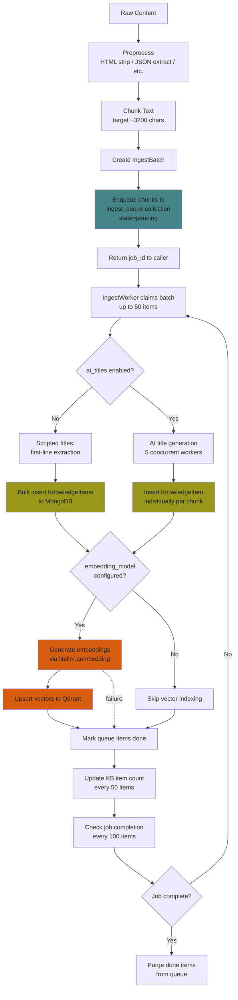

Note: embedding generation failures are logged but do not block ingestion. Items are saved to MongoDB regardless of whether the vector upsert succeeds.

### Chunking Strategy

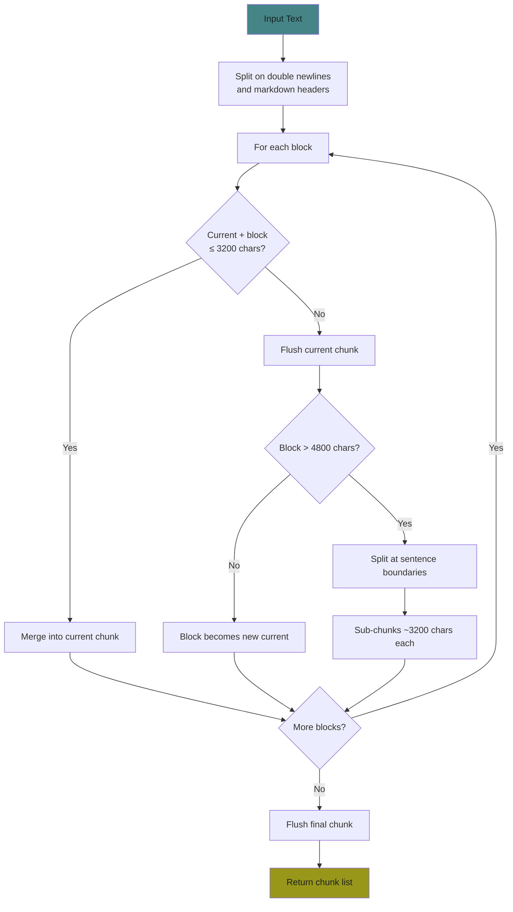

**Chunk size presets:**

| Preset  | Target chars | Max chars | Approx tokens |
|---------|-------------|-----------|---------------|
| small   | 1,600       | 2,400     | ~400          |
| medium  | 3,200       | 4,800     | ~800 (default)|
| large   | 6,400       | 9,600     | ~1,600        |
| xlarge  | 12,800      | 19,200    | ~3,200        |

Split boundaries: paragraphs first, then sentences.

## HuggingFace Dataset Ingestion

Datasets from HuggingFace Hub can be imported directly into a knowledge base. The service auto-detects the dataset format and extracts text content, which then flows through the standard ingestion pipeline.

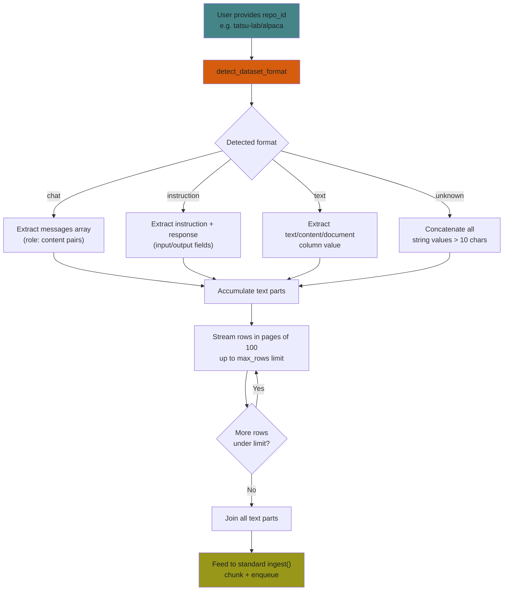

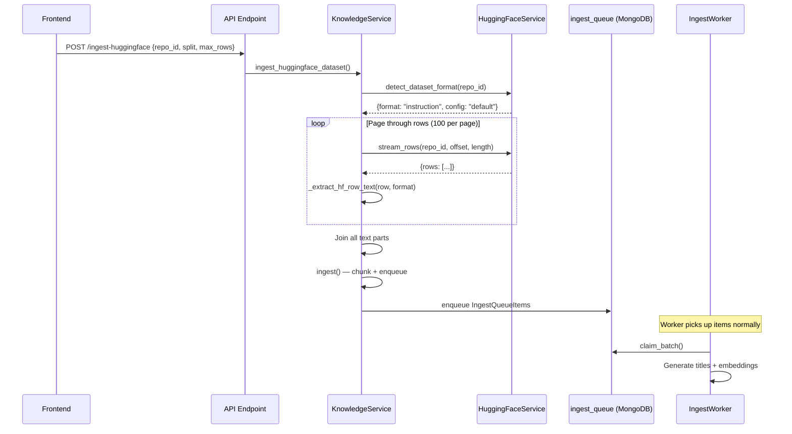

**Format detection** inspects the first page of rows and checks column names:
- **chat**: has `messages` or `conversations` columns
- **instruction**: has `instruction`/`input`/`prompt` + `response`/`output`/`answer` columns
- **text**: has `text`, `content`, `document`, `passage`, or similar columns
- **unknown**: falls back to concatenating all string values

## Hybrid Retrieval

When an agent with linked knowledge bases receives a query, the system runs both vector and text search in parallel and fuses the results.

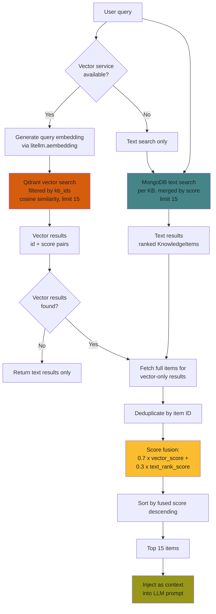

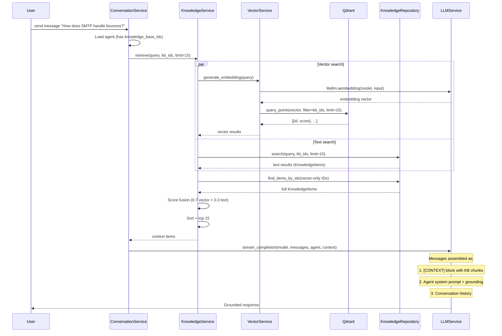

**Score fusion details:**
- Text results are assigned a rank-based score: first result = 1.0, last = ~0.3 (linear decay)
- Vector scores come directly from Qdrant (cosine similarity, 0.0 to 1.0)
- Fused score = `0.7 * vector_score + 0.3 * text_rank_score`
- Items appearing in only one search get 0.0 for the missing component

**Grounding instruction appended to system prompt:**
> "You have been provided with a knowledge base context. Base your answers on that context. If the context doesn't contain enough information to answer accurately, say 'I don't have that information in my knowledge base' -- never fabricate information."

## Vector Search Architecture

Vector search is powered by Qdrant and integrates with litellm for embedding generation.

### Qdrant Collection

| Property      | Value                          |
|---------------|--------------------------------|
| Collection    | `knowledge_vectors`            |
| Distance      | Cosine similarity              |
| Payload       | `{kb_id: str, title: str}`     |
| Index         | `kb_id` field (keyword type)   |

The collection is created lazily on first upsert, with the vector dimension inferred from the embedding model's output.

### Embedding Generation

Embeddings are generated via `litellm.aembedding()` using the model configured in system settings (`embedding_model` field). The model ID follows the standard `provider/model_name` format (e.g., `openai/text-embedding-3-small`).

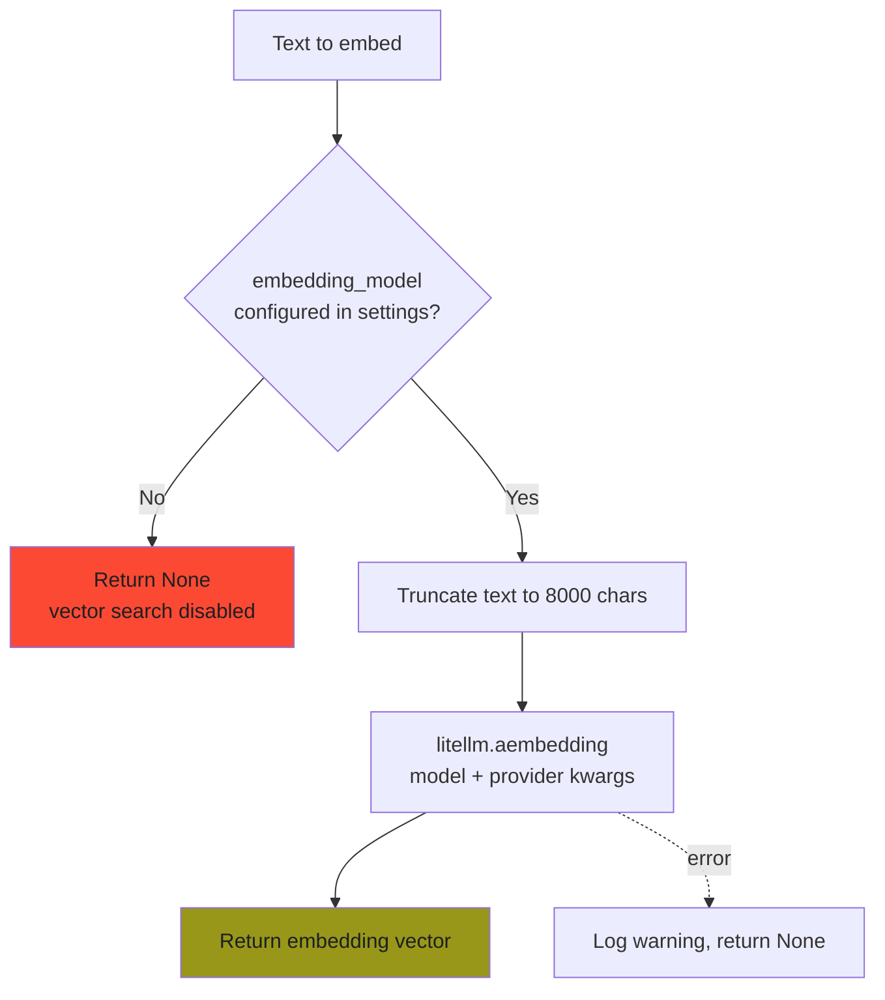

**Batch embedding** sends all texts in a single API call. On failure, falls back to individual calls per text, so partial failures still produce results.

### Graceful Fallback

When no `embedding_model` is configured in system settings:
- `VectorService.generate_embedding()` returns `None`
- `VectorService.generate_embeddings_batch()` returns `[None, ...]`
- The ingest worker skips vector upsert entirely
- Retrieval falls back to MongoDB text search only (keyword matching)
- The system is fully functional without Qdrant -- vector search is an enhancement, not a requirement

### Vector Lifecycle

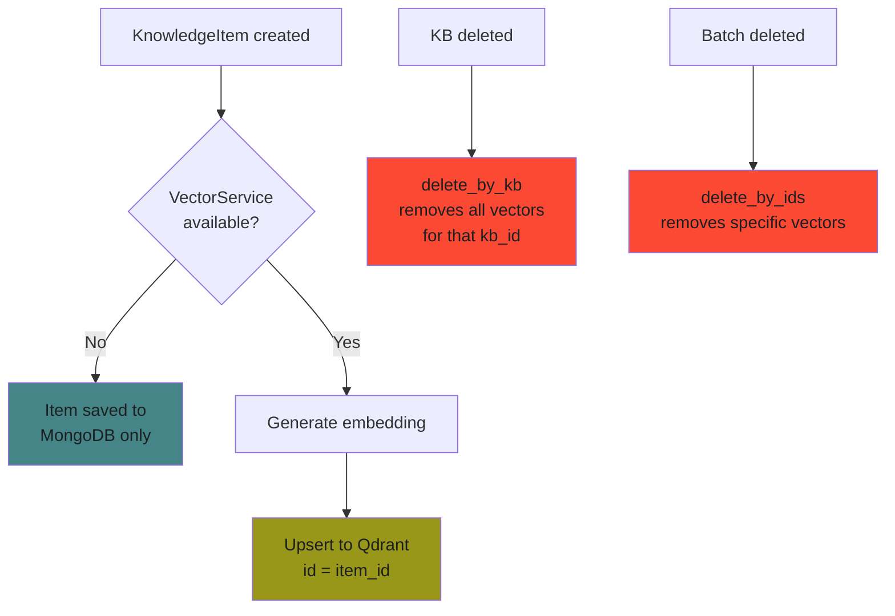

## Ingest Worker

The `IngestWorker` is a long-lived asyncio task started at application boot. It continuously polls the `ingest_queue` MongoDB collection and processes items in batches.

### Worker Configuration

| Constant               | Value | Description                              |
|------------------------|-------|------------------------------------------|
| `POLL_INTERVAL`        | 1s    | Sleep between polls when queue is empty   |
| `BATCH_SIZE`           | 50    | Items claimed per processing cycle        |
| `CONCURRENT_AI_WORKERS`| 5     | Max parallel LLM calls for AI titles      |
| `STALE_CHECK_INTERVAL` | 30    | Cycles between stale item checks          |
| `STALE_TIMEOUT`        | 120s  | Timeout for individual AI title generation|
| `COUNT_UPDATE_INTERVAL`| 50    | Items processed before updating KB count  |
| `JOB_CHECK_INTERVAL`   | 100   | Items processed before checking job done  |

### Batch Processing Flow

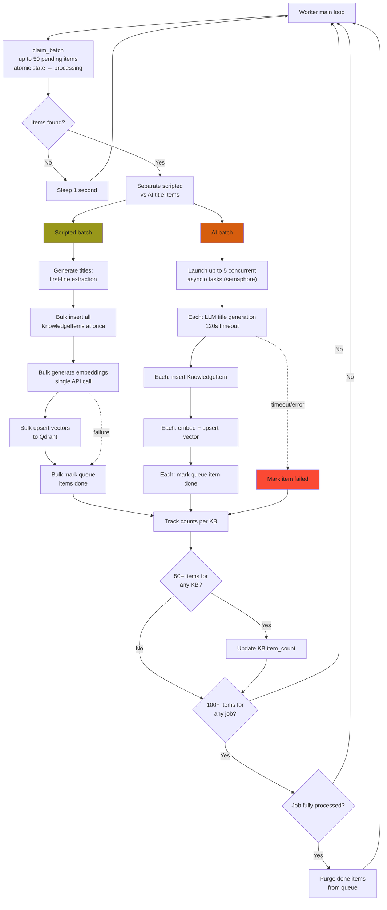

### Crash Recovery

On startup, the worker resets any `processing` items back to `pending`. This handles the case where the application crashed or was restarted while items were mid-processing.

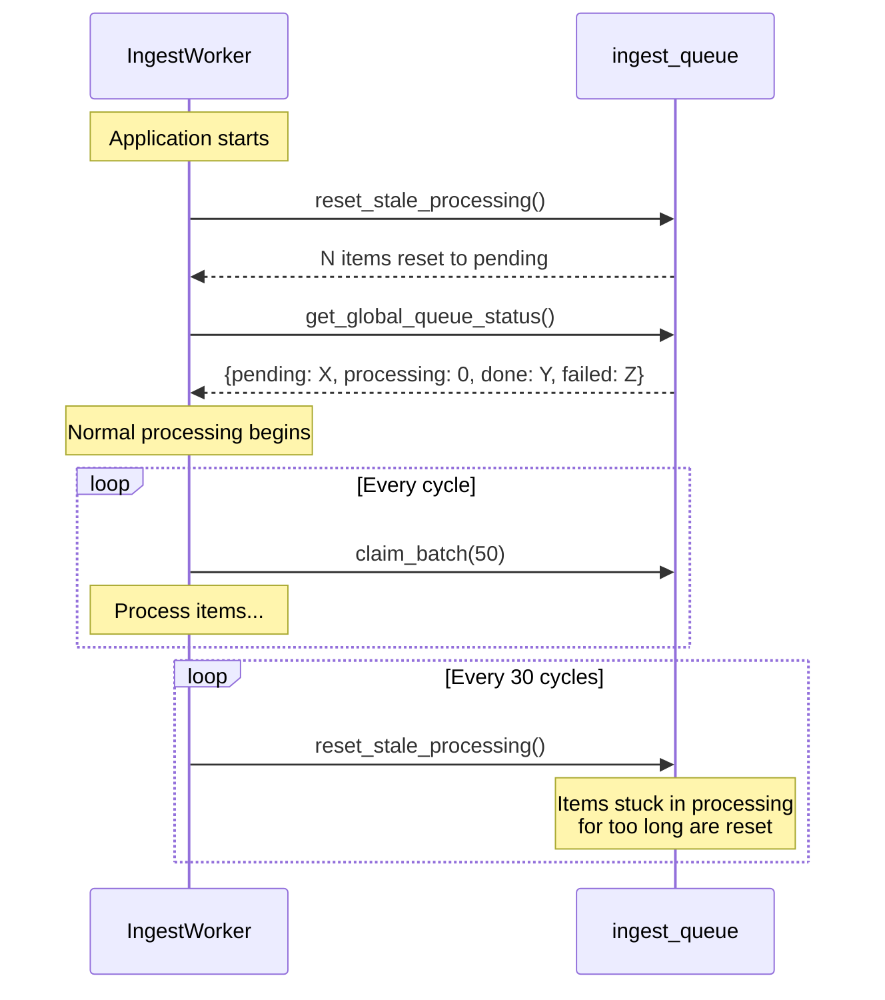

During normal operation, stale processing items are also checked every 30 polling cycles (approximately 30 seconds when idle) and reset to `pending` so they can be retried.

## IETF RFC Ingestion

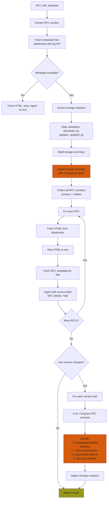

**Lineage summary includes:**
- Which RFCs this one obsoletes/is obsoleted by
- Which RFCs update/are updated by this one
- Compliance note: "Behavior valid under an older RFC may be non-compliant under newer versions"

**Changes analysis per version pair:**
- What was valid before but is now changed/prohibited
- New requirements added
- Deprecated behaviors
- Security-relevant changes

## Deep Research Mode

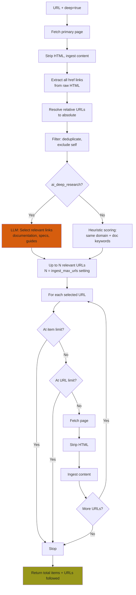

## Model Resolution for Ingestion

The ingestion model (used for title generation, link selection, and RFC analysis) is resolved independently from the agent chat model:

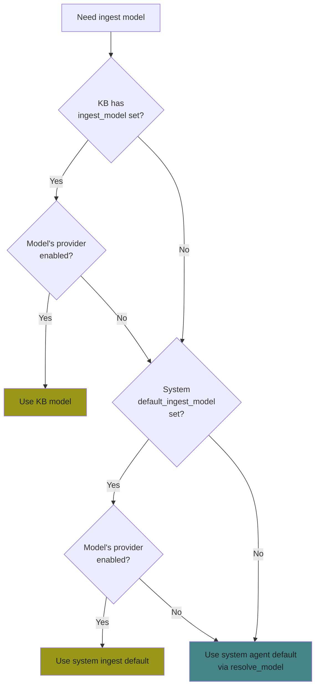

**Priority chain:** KB override -> system ingest default -> system agent default

## Limits and Safety

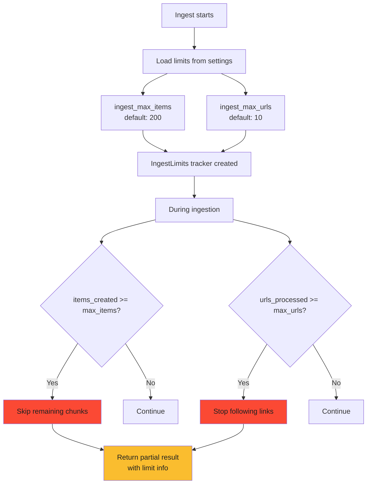

## Background Processing

Ingestion uses two layers: `IngestManager` handles chunking and enqueuing, while `IngestWorker` processes the persistent queue.

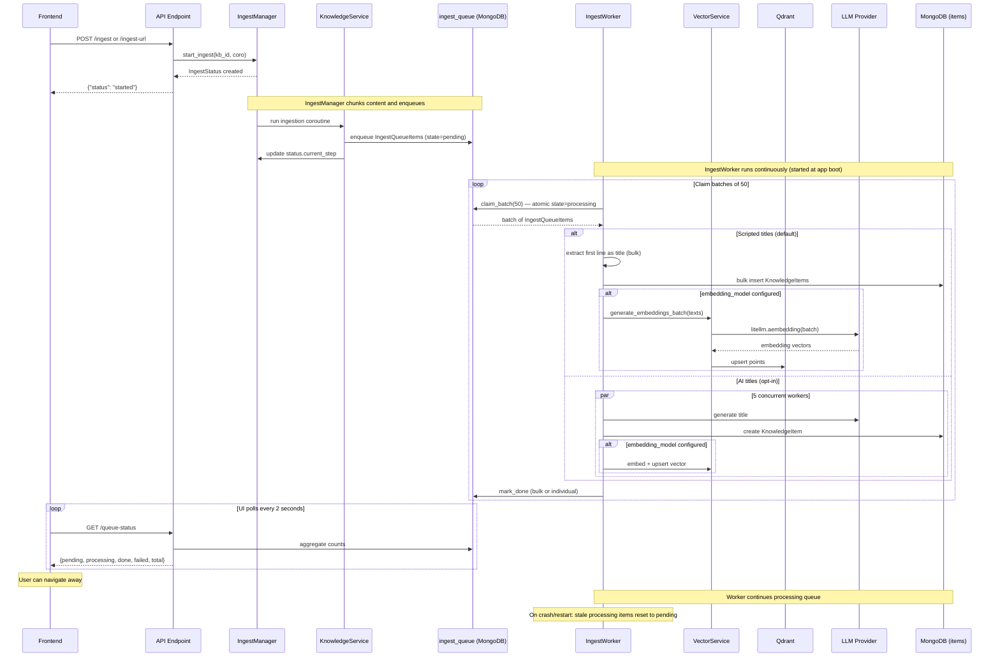

## Version Control (Batches)

```mermaid
flowchart TD
    A[Each ingest operation] --> B[Create IngestBatch record]
    B --> C[All items get batch_id]
    C --> D[Batch tracks: source, item_count, timestamp]
    
    E[Admin reviews batches] --> F[GET /batches - newest first]
    F --> G{Bad ingest?}
    G -->|Yes| H[DELETE /batches/{id}]
    H --> I[Delete all items<br/>with that batch_id]
    I --> I2[Delete vectors from Qdrant<br/>for those item IDs]
    I2 --> J[Delete batch record]
    J --> K[Update KB item count]
    
    G -->|No| L[Keep]

    style H fill:#fb4934,color:#1d2021
    style K fill:#98971a,color:#1d2021
```

## Data Model

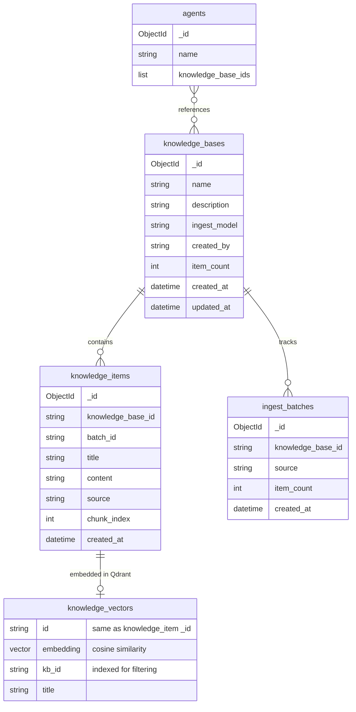
