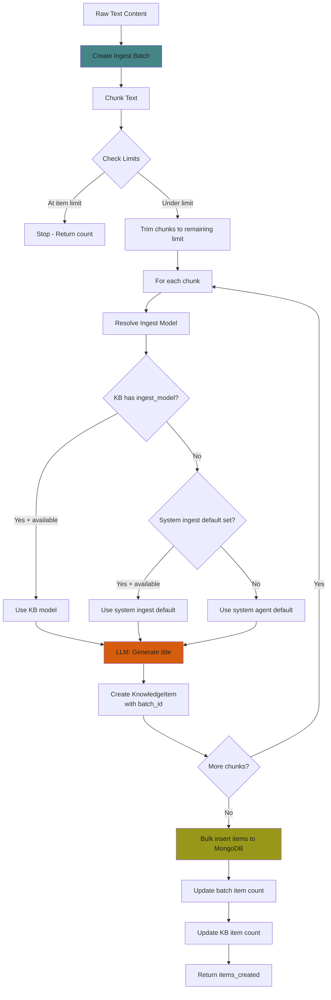
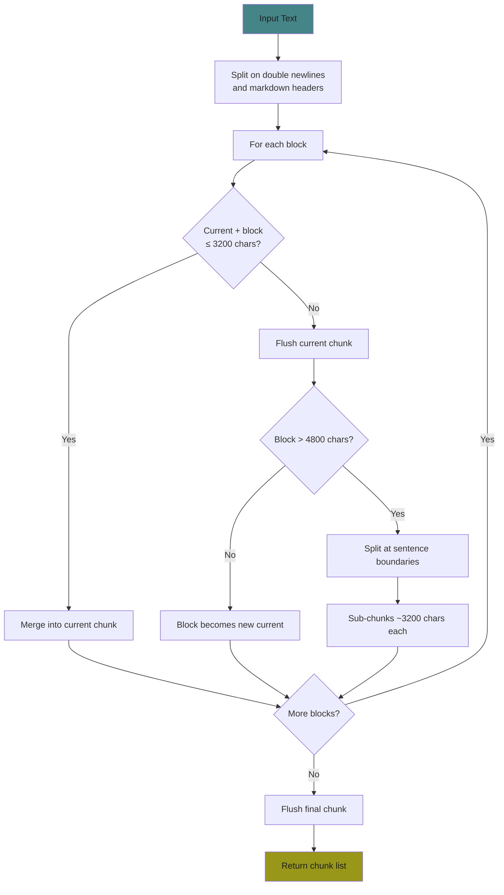
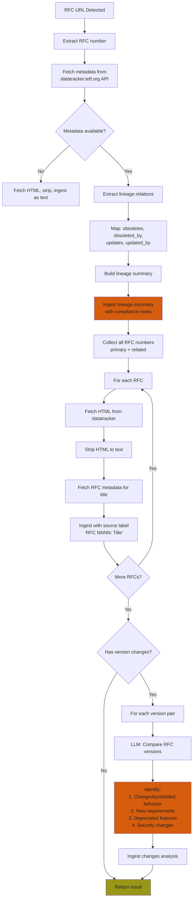
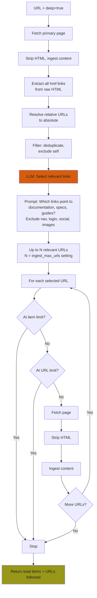
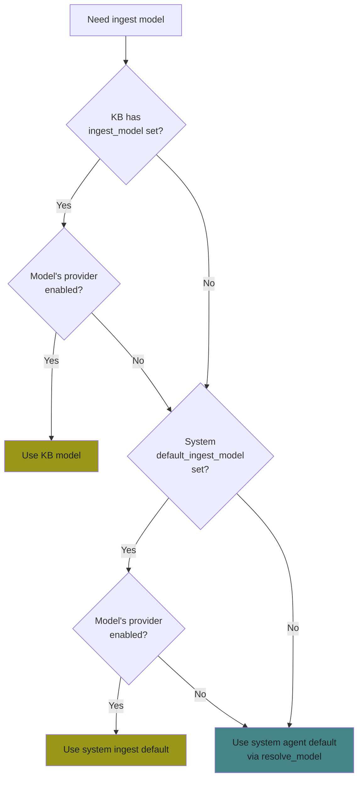
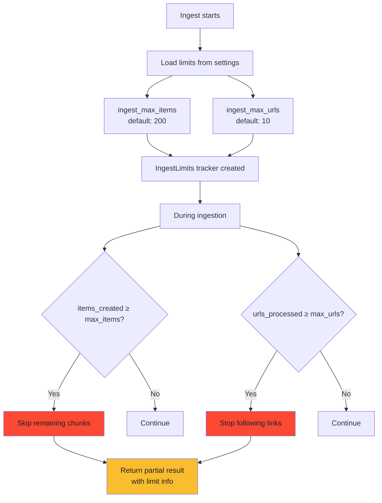
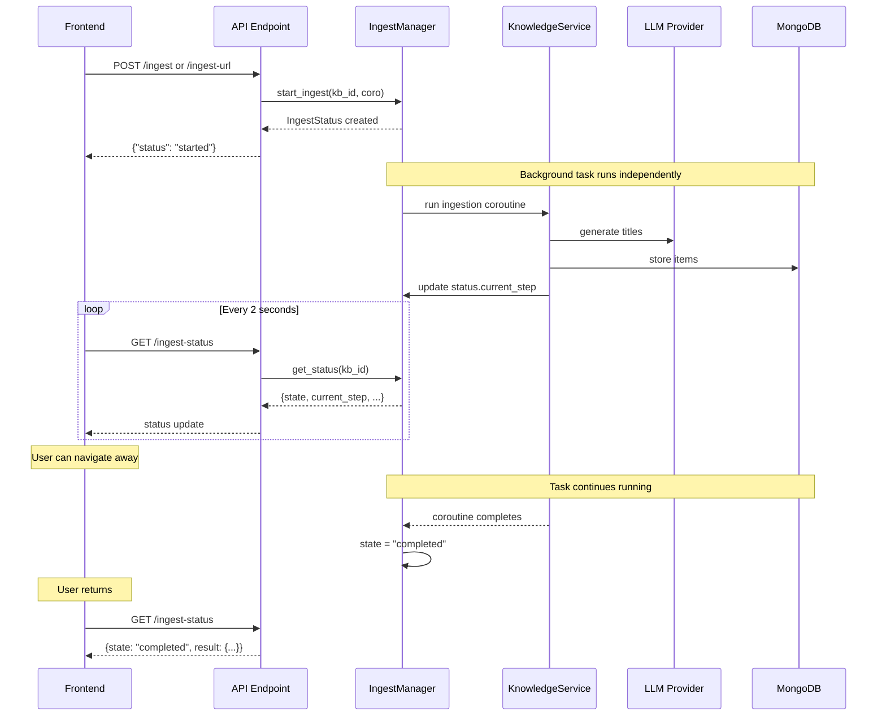
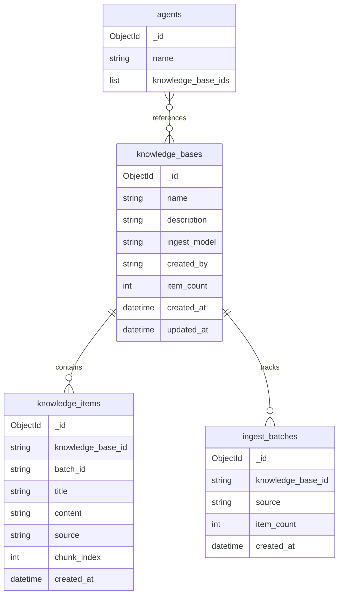
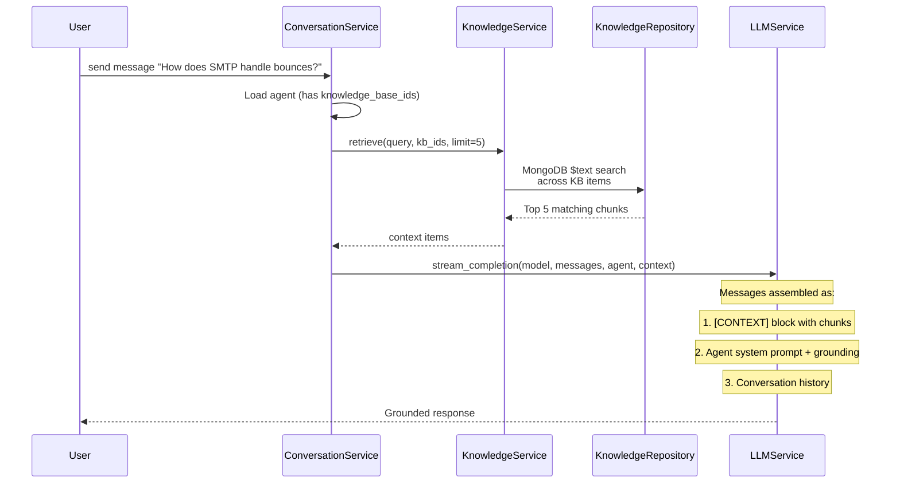

# Knowledge Ingestion Engine

## Overview

The knowledge ingestion engine processes raw content (text, URLs, files) into searchable knowledge items that agents use to ground their responses. It supports plain text, HTML pages, IETF RFCs (with full lineage analysis), and deep research mode that follows related links.

## Ingestion Flow

### Entry Points

```mermaid
flowchart TD
    A[Admin Action] --> B{Input Type}
    B -->|Paste text| C[POST /knowledge-bases/{id}/ingest]
    B -->|Upload .txt/.md| C
    B -->|URL| D[POST /knowledge-bases/{id}/ingest-url]
    
    C --> E[Text Ingestion Pipeline]
    D --> F{URL Type Detection}
    
    F -->|datatracker.ietf.org| G[RFC Ingestion Pipeline]
    F -->|Any other URL| H{Deep Research?}
    
    H -->|No| I[Fetch & Strip HTML]
    H -->|Yes| J[Deep Research Pipeline]
    
    I --> E
    J --> K[Fetch Primary URL]
    K --> E
    K --> L[Extract & Analyze Links]
    L --> M[LLM Selects Relevant Links]
    M --> N[Fetch Each Related URL]
    N --> E
    
    G --> O[Fetch RFC Metadata]
    O --> P[Map Lineage]
    P --> Q[Ingest All Related RFCs]
    Q --> E
    Q --> R[Generate Changes Analysis]
    R --> E

    style G fill:#d65d0e,color:#1d2021
    style J fill:#d65d0e,color:#1d2021
    style E fill:#98971a,color:#1d2021
```

### Text Ingestion Pipeline

This is the core pipeline that all content flows through regardless of source.



### Chunking Strategy



**Target sizes:**
- Target chunk: ~3200 chars (~800 tokens)
- Max chunk: ~4800 chars (~1200 tokens)
- Split boundaries: paragraphs first, then sentences

### IETF RFC Ingestion



**Lineage summary includes:**
- Which RFCs this one obsoletes/is obsoleted by
- Which RFCs update/are updated by this one
- Compliance note: "Behavior valid under an older RFC may be non-compliant under newer versions"

**Changes analysis per version pair:**
- What was valid before but is now changed/prohibited
- New requirements added
- Deprecated behaviors
- Security-relevant changes

### Deep Research Mode



## Model Resolution for Ingestion

The ingestion model (used for title generation, link selection, and RFC analysis) is resolved independently from the agent chat model:



**Priority chain:** KB override → system ingest default → system agent default

## Limits and Safety



## Background Processing



## Version Control (Batches)

```mermaid
flowchart TD
    A[Each ingest operation] --> B[Create IngestBatch record]
    B --> C[All items get batch_id]
    C --> D[Batch tracks: source, item_count, timestamp]
    
    E[Admin reviews batches] --> F[GET /batches - newest first]
    F --> G{Bad ingest?}
    G -->|Yes| H[DELETE /batches/{id}]
    H --> I[Delete all items<br/>with that batch_id]
    I --> J[Delete batch record]
    J --> K[Update KB item count]
    
    G -->|No| L[Keep]

    style H fill:#fb4934,color:#1d2021
    style K fill:#98971a,color:#1d2021
```

## Data Model



## Context Injection at Query Time



**Grounding instruction appended to system prompt:**
> "You have been provided with a knowledge base context. Base your answers on that context. If the context doesn't contain enough information to answer accurately, say 'I don't have that information in my knowledge base' — never fabricate information."
